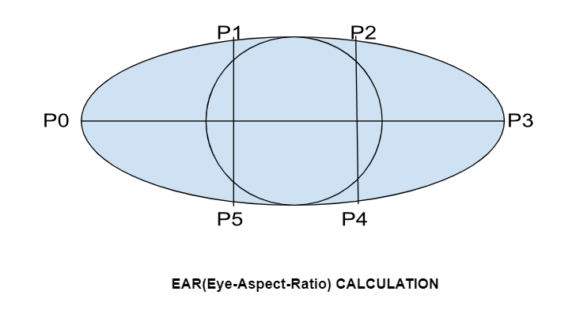
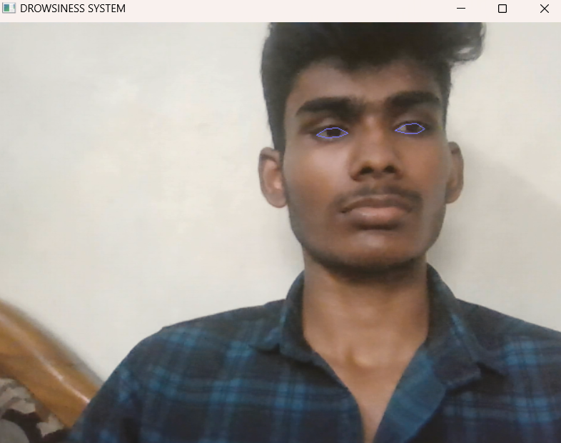
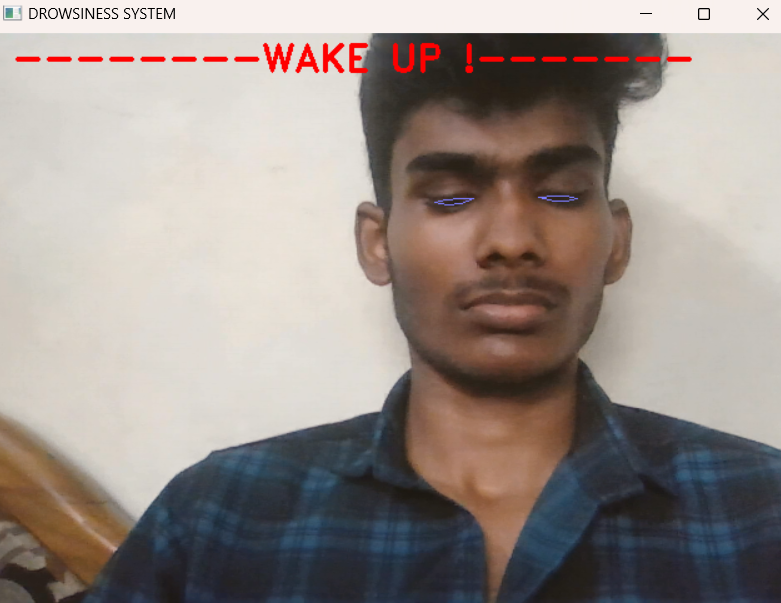

# DROWSINESS ALERT SYSTEM
## AIM:
### To implement a drowsiness alert system using python
## COMPONENTS REQUIRED:
### 1. Jupyter Lab
### 2. Python 
## ALGORITHM:
* ###  Install the necessary python libraries i.e opencv, dlib etc...
* ###  Apply the EAR(Eye-Aspect Ratio)Algorithm
* ### Upload the trained dataset model in the file section
* ### Choose the file path for reading the model
* ### Calculate the lefteye and right eye seperately
* ### Now find the average of both the eyes
* ### Compare it with the threshold value for the detection of the eyes
* ### Write the code for the opening and closing of the camera
* ### Setup the alert sound when drowsiness is detected
* ### Execute all the programs in order to get the appropriate output
## EAR CALCULATION:

## FACIAL LANDMARKS:

## Upscaling:
Upscaling, in the context of computer vision and image processing, refers to the process of increasing the size or resolution of an image. It involves the interpolation of pixel values to create a larger image that contains more detail than the original, lower-resolution image. The purpose of upscaling is often to improve the visual quality or to enhance the accuracy of certain image processing tasks.
## BGR Format:
In BGR format, an image is represented as a 3-channel matrix where each channel corresponds to the intensity of the Blue, Green, and Red components of the image, respectively. The BGR format is a common format used in OpenCV and is different from the more common RGB format.
## PROGRAM:
```py
from scipy.spatial import distance
from imutils import face_utils
import imutils
import dlib
import cv2
import winsound
import numpy as np

threshold_value = 0.27
check_frame = 25

def calculation(eye):
    D1 = distance.euclidean(eye[1], eye[5])
    D2 = distance.euclidean(eye[2], eye[4])
    D3 = distance.euclidean(eye[0], eye[3])
    ear = (D1 + D2) / (2.0 * D3)
    return ear

def play_sound():
    winsound.Beep(1100, 500)

predict = dlib.shape_predictor("shape_predictor_68_face_landmarks.dat")
detect = dlib.get_frontal_face_detector()

(Left_Start, Left_End) = face_utils.FACIAL_LANDMARKS_68_IDXS["left_eye"]
(Right_Start, Right_End) = face_utils.FACIAL_LANDMARKS_68_IDXS["right_eye"]

cap = cv2.VideoCapture(0)
track = 0

while True:
    frame_check,frame = cap.read()
    frame = imutils.resize(frame)
    img = cv2.cvtColor(frame, cv2.COLOR_BGR2GRAY)
    output = detect(img, 0)
    for output in output:
        shape = predict(img, output)
        shape = face_utils.shape_to_np(shape)
        LeftEye = shape[Left_Start:Left_End]
        RightEye = shape[Right_Start:Right_End]
        LeftEAR = calculation(LeftEye)
        RightEAR = calculation(RightEye)
        Eye_aspect_ratio = (LeftEAR + RightEAR) / 2.0
        LeftHull = cv2.convexHull(LeftEye)
        RightHull = cv2.convexHull(RightEye)
        cv2.drawContours(frame, [LeftHull],-1,(255, 125, 125),1)
        cv2.drawContours(frame, [RightHull],-1,(255, 125, 125),1)
        if Eye_aspect_ratio < threshold_value:
            track +=2 
            if track > check_frame:
                cv2.putText(frame, "--------WAKE UP !-------",(15,30),
                        cv2.FONT_HERSHEY_DUPLEX, 1, (0,0,255), 2) 
                play_sound()
        else:
            track= 0
    cv2.imshow("DROWSINESS SYSTEM", frame)
    key = cv2.waitKey(1) & 0xFF
    if key == 27:
        break
cv2.destroyAllWindows()
```
## OUTPUT:
### AFTER TESTING
### BEFORE DETECTION

### AFTER DETECTION

## RESULT:
### Thus the drowsiness system using python has been implemented successfully